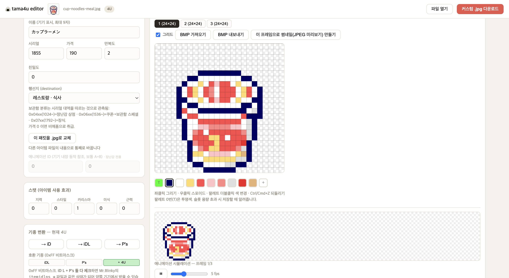
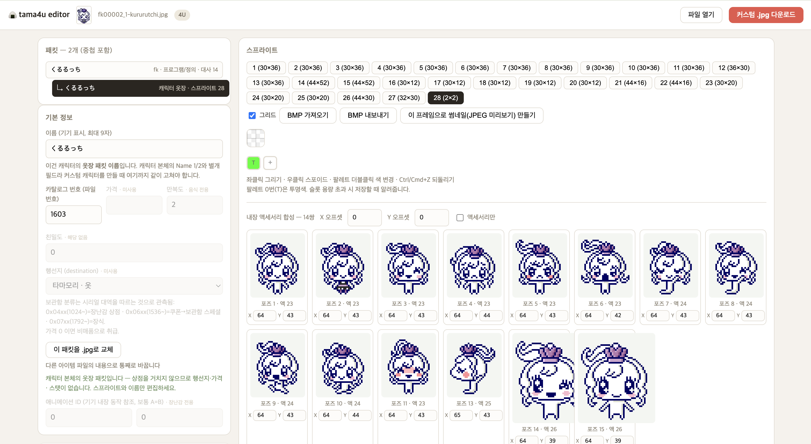
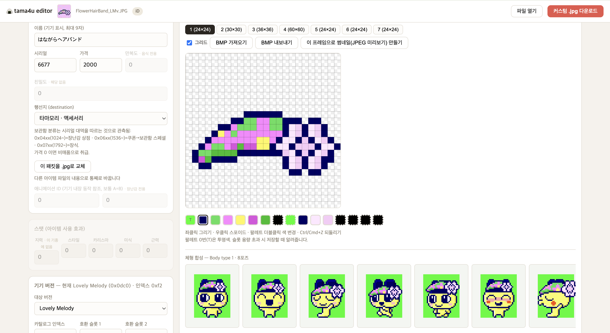
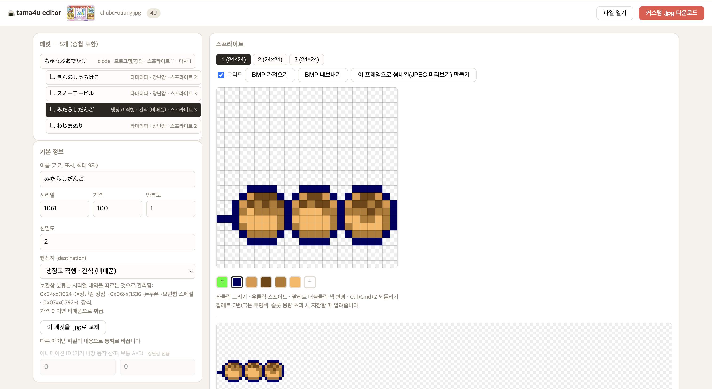
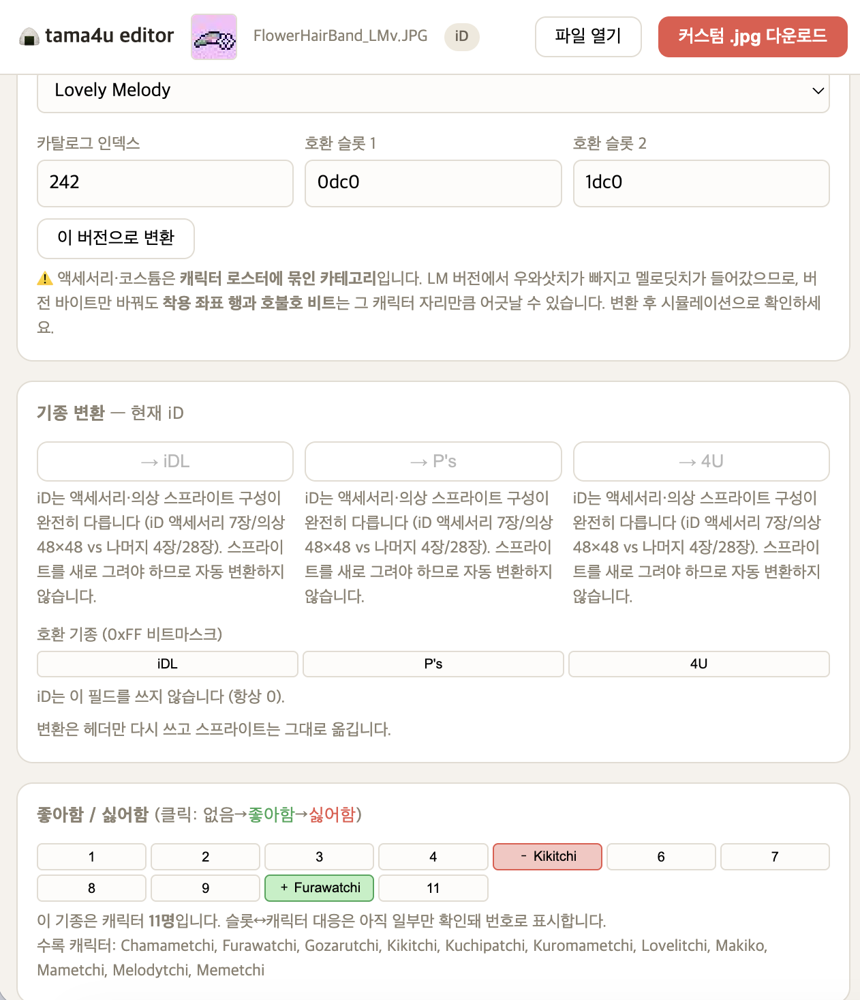

# tama4u-tools

### ▶ [브라우저에서 바로 열기 — jeyi113.github.io/tama4u-tools](https://jeyi113.github.io/tama4u-tools/)

컬러 다마고치 4기종(**iD / iD L / P's / 4U**) 다운로드 아이템(.jpg)의
파서·에디터. 공개된 포맷 문서가 없어 배포 파일 5,706개의 통계 분석으로
필드 위치를 역산했고, 그 결과를 이 README에 스펙으로 정리했다.
Mr.Blinky의 Tama Image Editor / Tama 4U character data editor와 교차 검증됨.

설치할 것도, 올릴 것도 없다 — 파일은 브라우저 안에서만 처리된다.

```
python3 -m tama4u charset <download-pack>      # 내부 문자코드 테이블 생성 (최초 1회)
python3 -m tama4u info <file.jpg>              # 패킷 구조/스탯/스프라이트 요약
python3 -m tama4u verify <dir|file>            # 체크섬 전수 검증
python3 -m tama4u export <file.jpg> -o out/    # 스프라이트 → 인덱스 BMP
```

## 실행

**웹 데모** — <https://jeyi113.github.io/tama4u-tools/>

`docs/index.html` 은 자기 완결형이라 내려받아 더블클릭해도 똑같이 동작한다.
파일은 브라우저 안에서만 처리되고 어디로도 전송되지 않는다. 참조 스프라이트를
싣지 않으므로 기기 시뮬레이션만 빠져 있다.

**로컬 파이썬 에디터** — 시뮬레이션 포함, 배치 작업용 CLI 제공:

```bash
python3 -m tama4u edit          # http://127.0.0.1:8477
```

### 같은 로직, 두 구현

포맷 로직은 파이썬(`tama4u/`)이 기준이고, 웹용 JS 포팅(`web/`)이 그것을
그대로 옮긴 것이다. 둘이 조용히 어긋나지 않도록 **배포되는 번들 자체를**
파이썬과 파일 단위로 대조한다:

```bash
python3 web/build.py                              # docs/index.html 생성
python3 web/dump.py <pack-dir> > /tmp/py.json     # 파이썬 기준 덤프
node web/verify-bundle.mjs /tmp/py.json <pack-dir>
```

다운로드 팩 4종 **5,706개 파일 전부 일치**한다.

## 스크린샷

### 아이템 편집
좌측에 이름·시리얼·가격·만복도·행선지·5스탯, 우측에 스프라이트 탭과 픽셀
에디터·팔레트·BMP 입출력. 하단은 프레임 순환 애니메이션 미리보기.



### 캐릭터 내장 액세서리 합성
옷장 패킷의 포즈 15장과 내장 액세서리 4장을 14쌍으로 합성해 보여준다.
각 타일 아래 X·Y가 그 포즈의 착용 좌표이고, 타일을 드래그하면 1px 스냅으로
값이 바뀐다.



### 기종별 레이아웃 (iD)
같은 화면이 기종에 따라 달라진다 — iD 액세서리는 7프레임 구성이고,
쓰지 않는 필드(만복도·스탯)는 회색으로 비활성된다.



### 중첩 패킷 (외출지)
외출지 하나에 보상 아이템 4개가 중첩돼 있고, 각각을 독립적으로 편집할 수 있다.



### 펌웨어 버전 변환 · 호불호
iD 전용. 오리지널 ↔ Lovely Melody 변환과 기종 변환, 그리고 iD에서만 16칸인
호불호 그리드.



## 준비물

다운로드 팩(반다이 배포 .jpg)과 참조 스프라이트는 저작물이라 저장소에
포함하지 않는다. 로컬에 준비한 뒤 문자표를 한 번 생성하면 된다.

```bash
python3 -m tama4u charset <download-pack>   # tama4u/charset*.json 생성
```

기기 시뮬레이션에 쓰는 체형별 참조 스프라이트는 Mr.Blinky의 acposeditor
BMP를 `tama4u/charasprites/`에 넣으면 활성화된다(없어도 나머지는 동작).

## 지원 기종 (iD / iD L / P's / 4U)

컨테이너(TAMAGO 매직, u16 크기 필드, sum16 체크섬)와 **스프라이트 코덱은 전
기종 동일**. 다른 것은 아이템명 인코딩과 몇몇 오프셋뿐. 기종은 유니코드
다운로드명 접두어로 식별한다 (`tama4u.models`).

| 기종 | 유니코드 접두어 | ANSI ID 접두어 | 아이템명 | 가격 | 스프라이트 뱅크 |
|---|---|---|---|---|---|
| iD | `DL_MDP_` | (없음) | 0x5A, **1B/자** ×9 | 0x66 | **0x100** |
| iD L | `DL_iDLS_` | `id2_` | 0x5E, **1B/자** ×14 | 0x6C | **0x100** |
| P's | `DL_iDNS_` | `idn_` | 0x5E, **1B/자** ×14 | 0x6C | **0x100** |
| 4U | `DL_T4US_` | `t4u_` | 0x5E, 2B/자 ×9 | 0x76 | 0x200 |

접두어 끝 글자는 패킷 종류: `S`=아이템, `A`=캐릭터, `C`=옷.
구형 3기종은 **1바이트 문자 테이블**(~200자), 4U만 2바이트(0x04xx 대역).
`t4u_`/`id2_`/`idn_` 접두어가 한 팩 안에 섞여 있으므로 폴더가 아니라 접두어로
기종을 판정해야 한다 (P's 팩에는 iD L·4U 아이템이 다수 포함).
destination 코드(0x50-0x51)는 iDL·P's·4U가 공통 (`02 01` 식사 · `0d 02` 간식 ·
`2a 01` 장난감 · `33 00` 옷 · `34 00` 액세서리 · `1f 00` 방). iDL·P's에는 4U에
없는 `51 01` 대역이 있고, iD만 분류 체계가 다르다(`00 00` 다수).

검증: 4개 팩 5427 패킷 **체크섬 100% 통과**, 아이템명 디코딩 5425/5427.
문자 테이블은 `charset.build_tables()`로 자동 생성 — iD 161자 / iDL 196자 /
P's 190자 / 4U 188자.

## 컨테이너 포맷

`.jpg` = JPEG 미리보기 + `TAMAGO` 패킷(들). 번들 파일은 패킷이 연접(외출지,
빙고), 다운로드 캐릭터는 옷(fk) 패킷이 캐릭터 패킷 **안에 중첩**.
모든 패킷의 마지막 2바이트 = 앞 전체의 sum16 (BE). 기기는 최외곽 체크섬을
검증(중첩 패킷의 체크섬이 낡아도 동작하는 사례 있음).

| 오프셋 | 내용 |
|---|---|
| 0x00 | `TAMAGO` |
| 0x06 | UTF-16BE `DL_T4Ux_<이름>.jpg` (S=아이템, A=캐릭터, C=옷) |
| 0x32 | u16 BE 다운로드 파일 전체 크기 (JPEG 미리보기 + 패킷; 실측 ±2) |
| 0x34 | ASCII ID `t4u_<kind><serial>_<n>` |
| 0x4A | u16 BE 패킷 크기 (체크섬 포함) |
| 0x4C | 타입 시그니처 6B — 마지막 2B = destination 코드 (아래) |
| 0x52 | 8B 토큰 (파일마다 다름, 용도 미상) |
| 0x5A | u16 BE 시리얼 |
| 0x5E | 아이템명 u16 BE ×9, 내부 문자코드 (A=0x04E0, あ=0x0401, 전각공백=0x046C) |

### destination — 0x4E부터 4바이트

Mr.Blinky의 iDmakeDL이 이 필드를 그대로 노출한다(iD는 3바이트 변형).
두 번째 바이트가 섹션 id: 01 음식 · 02 액세서리 · 03 옷 · 04 장난감 · 07 인테리어.

| 코드 | 행선지 |
|---|---|
| `81 01 02 01` / `81 01 0d 02` | 레스토랑 식사 / 간식 |
| `81 01 01 01` / `81 01 01 02` | 냉장고 직행 (번들 보상, 비매품) |
| `81 04 2a 01` | 타마데파 (장난감) |
| `81 03 33 00` | 타마모리 (옷) |
| `81 02 34 00` | 타마모리 (액세서리) |
| `81 07 1f 00` | 고치 인테리어 (방) |
| `94 02 5b 01` / `81 08 29 00` / `94 02 47 02` | 게임센터 게임 / 빙고 / 외출지 |
| `94 02 48 03` | 다운로드 캐릭터 |
| `94 02 5b 02` | VDP · LCD 트윅 (본문 미해독) |

**iDL·P's·4U가 같은 코드를 쓴다** (iDmakeDL 화면과 대조 확인).
음식은 추가로 0x73=02.

**iD는 게임과 외출지를 행선지로 가를 수 없다.** 둘 다 `14 02 00 00`
하나를 쓰고(팩에서 게임 32 + 외출지 4, 예외 없음), 카테고리는 **0x64**에
따로 있다 — 게임 `0x37`, 외출지 `0x0F`. 그래서 행선지 카탈로그 항목은
`(라벨, 코드, 마스크, (오프셋, 값))` 형태를 갖고, 이 넷째 요소가 있으면
판별할 때 그 바이트까지 보고 카테고리를 고를 때 그 바이트도 같이 쓴다.

프로그램 패킷 324개(iD 36 · iDL 96 · P's 91 · 4U 101)가 전부 분류되며
미분류는 없다.

### 기기/펌웨어 버전 코드 (iD)

iD 팩을 폴더별로 집계하면 두 자리가 버전 표식으로 딱 갈린다.

| | 0x4C-0x4D (대상) | 0xF8-0xFB (추가 호환 2슬롯) | ANSI ID |
|---|---|---|---|
| 오리지널 iD 기본 아이템 | `cd 80` | `00000000` | 없음 |
| **Lovely Melody (LMv)** | **`0d c0`** | **`0dc0 1dc0`** | 있음 (`ac258_1` 형식) |
| 캐릭터별 상점(Chamametchi 등) | `cd 80` | `1dc0 1dc0` | 있음 |
| ID v1_3_1 | `cd 80` | `0000 1dc0` | 없음 |

즉 `cd80` = 오리지널, `0dc0` = Lovely Melody, `1dc0` = 또 다른 리비전이며
0xF8·0xFA는 "이 버전에서도 동작" 목록으로 보인다. 폴더 안에서 100% 일관된다.

**버전이 갈리는 카테고리는 여자아이용 액세서리와 여자아이용 포토 스튜디오
코스튬 둘뿐이고, 나머지 카테고리는 버전 간 공통이다.** LM 버전이 멜로딧치를
더하면서 캐릭터에 묶인 데이터(착용 좌표 행)를 따로 손봐야 했기 때문이다.
호불호 쪽은 명단이 밀리지 않는다 — 멜로딧치는 뒤쪽 빈 슬롯 12를 쓰고
우와삿치(슬롯 10)는 그대로 남는다(아래 호불호 절 참조).

**변환**은 스프라이트를 건드릴 필요가 없다(7프레임·치수·좌표 블록 784B 동일).
바꿀 곳은 0x4C-0x4D 버전 코드, 0x50 카탈로그 인덱스(오리지널 `0x01~0x27` /
LMv `0xDE~0xFE`), 0xF8-0xFB 호환 목록. 다만 위 두 카테고리는 로스터가 달라
착용 좌표 행이 캐릭터 한 자리만큼 어긋날 수 있으므로 변환 후 확인이
필요하다. 에디터의 **"기기 버전" 카드**가 이 세 곳을 한 번에 바꾸고, 로스터
민감 카테고리에는 경고를 띄운다.

iDmakeDL도 이 바이트로 버전을 표시한다(화면의 `Tamagotchi iD` /
`Lovely-Melody ver.` 줄).

### 카테고리별 유효 필드

iDmakeDL이 아이템 종류마다 비활성화하는 항목과 동일하게 맞춘 규칙
(`items.editable_fields`). 5스탯은 **P's부터** 존재하고 iD·iD L에는 없다.

| 종류 | 가격 | 만복도 | 친밀도 | 호불호 | 5스탯 |
|---|---|---|---|---|---|
| 식사·간식 gh/oy | ✓ | ✓ | ✓ | ✓ | P's·4U |
| 장난감 as | ✓ | — | ✓ (iD 제외) | ✓ (iD 제외) | P's·4U |
| 옷 fk / 액세서리 ac | ✓ | — | — | ✓ | P's·4U |
| 방 bg/lv | ✓ | — | — | — | P's·4U |

에디터는 이 규칙대로 해당 입력칸·패널을 숨긴다.

## 아이템 스탯 — 기종별 오프셋

`models.LAYOUTS`에 정리. P's와 4U는 **같은 배치를 0x0A만큼 당긴 것**이고,
iD L은 가격·애니·만복도·친밀도 자리는 P's와 같으나 (훨씬 큰) 호불호 마스크를
친밀도 바로 뒤에 두고 5스탯이 없다. iD는 더 압축된 별도 배치.

| | 가격 | 애니(장난감) | 만복도 | 친밀도 | 호불호 | 5스탯 |
|---|---|---|---|---|---|---|
| iD | 0x66 (장난감만 **0x6C**) | — | 0x6C | 0x6D | 0x68 (4B/**16칸**) | — |
| iD L | 0x6C | 0x6E | 0x70 | 0x71 | 0x72 (19B/**74칸**) | — |
| P's | 0x6C | 0x6E | 0x70 | 0x71 | 0x8A (8B/32칸) | 0xAE |
| 4U | 0x76 | 0x78 | 0x7A | 0x7B | 0x94 (8B/32칸) | 0xB8 |

호불호는 캐릭터당 2비트(LSB-first, bit0=like, bit1=dislike).

슬롯↔캐릭터 대응은 **호불호 한 쌍만 다른 파일 44개**로 확정했다
(`ID_호불호` 5, `IDL_호불호` 23, `ps_호불호` 16 — 파일명이
`기종_호캐릭터_불호캐릭터`). 파일마다 정확히 like 1개 · dislike 1개만
켜져 있으므로 켜진 비트 위치가 곧 그 이름의 슬롯이다. 44개 전부
슬롯 충돌 없이 풀렸고, 표에서 되인코딩하면 **44/44 바이트가 일치**한다.

| 기종 | 마스크 | 칸 | 팩이 쓰는 슬롯 | 이름 확정 |
|---|---|---|---|---|
| iD | 0x68-0x6B | 16 | 0-15 전부 | 12 |
| iD L | 0x72-0x84 | 74 | 0-57, 71-73 (58-70 미사용) | 46 |
| P's | 0x8A-0x91 | 32 | 0-31 전부 | 32 |
| 4U | 0x94-0x9B | 32 | 0-31 전부 | 32 |

**P's는 4U와 명단도 순서도 같다.** 44개에서 독립적으로 뽑은 P's 32칸이
기존 4U 목록과 인덱스까지 완전히 일치했다(로마자 표기만 다름:
Rightchi/Righttchi, Takutotchi/Tacttchi, Atchitchi/Acchitchi,
Warutsutchi/Waltztchi, Chokomakatchi/Chocomakatchi,
Hoshigalutchi/Hoshigirltchi, Chouchoutchi/Chochotchi, Harputchi/Harptchi).
서로를 검증한 셈이라 두 기종은 한 목록을 공유한다.

**iD는 11칸이 아니라 16칸이다.** 이전 판에서 "22비트/11칸, 슬롯 11은
한 번도 안 쓰이고 0x6B는 별개 바이트"라고 적었던 건 틀렸다. 팩 전수
조사에서 0x68-0x6B의 16슬롯이 **모두** 세팅되고(CD80 579패킷에서 16칸
전부, 0DC0 35패킷에서 13번만 빼고), 무엇보다 `id_Mametchi_Meloditchi`가
멜로딧치를 **슬롯 12**(0x6B bit0)에 넣는다. 11칸 가설로는 존재할 수 없는
값이다.

같은 이유로 "Lovely Melody는 우와삿치를 빼고 뒤를 한 칸 당긴다"는
가설도 폐기한다. v=0DC0 파일 하나에 우와삿치(슬롯 10)와 멜로딧치(슬롯 12)가
**동시에** 주소를 갖는다 — 둘은 배타적이지 않고, 명단이 밀리지도 않는다.
바꿔 말해 0DC0 표는 확정이고, CD80(오리지널 iD)이 같은 표를 쓰는지는
라벨된 CD80 파일이 없어 아직 미검증이다.

**iD L의 0x7A-0x84도 마스크의 일부다.** 이전 판에서 "항상 0인 3바이트와
무관한 희소 필드"라고 적었던 그 자리가 15주년·스페이시 펌웨어가 기본 32명
위에 얹는 캐릭터들이다 — 47-57에 오야짓치·오토깃치·타마히코 왕자 등 11명,
71-73에 피포스펫치·아카스펫치·히메스펫치 3명. 라벨 파일이 닿지 못한
32-46(15칸)은 팩이 쓰지만 이름 미상이라 에디터에서 `#슬롯` 번호로 둔다.

내부 문자표는 **4기종이 같은 표**다 — 4U만 각 코드를 `0x04xx`로 저장할
뿐이고, 1바이트 표의 모든 코드가 4U의 `0x0400 + code`와 일치한다. 그래서
네 표를 합치면 서로의 빈칸이 메워진다(각 표 218자).

표를 실제로 합치는 건 `charset.canonical_bytes()`다. 네 표는 각각 그 팩에
등장한 문자열에서 역산한 것이라 기종마다 오추론이 남아 있었고, 그대로 쓰면
영문 이름을 저장할 때 `no internal code known for 'S'`로 막혔다. 코드별
다수결로 합치되 **연속인 두 블록을 못 박는다** — A-Z가 `0xE0`-`0xF9`,
0-9가 `0x6D`-`0x76`. 이 규칙을 어기는 항목은 5개뿐이었고 전부 소수의견이다:

| 코드 | 옛 값 | 옳은 값 | 근거 |
|---|---|---|---|
| iD L `0xF2` | マ | S | マ는 `0x95`에 따로 있음 |
| P's `0xE8` | n | I | `ウィッグn` → `ウィッグ`+`WIG` |
| P's `0xF8` | e | Y | `スムーチウィッグe` → `…ウィッグY` |
| P's `0x5B` | ー | ・ | ー는 `0x51`에 따로 있음. `アンダーーザーシー` → `アンダー・ザ・シー` |
| P's `0x6C` | `_` | 전각공백 | `DP_PATCh` → `DP　PATCH` |

교정 전후로 팩의 아이템 이름 134개가 달라지는데, 전부 깨진 글자가 실제
단어로 바뀌는 방향이다(`ＥZGＯTChn` → `EZGOTCHI`, `DＥbuG_ＯN` →
`DEBUG　ON`). 반각/전각 통일은 영숫자에만 적용한다 — NFKC를 그대로
쓰면 `…`가 점 세 개로 풀려 코드↔문자 1:1이 깨지기 때문이다.

### 남은 빈칸을 P's 번역 패치로 메우기

네 팩이 한 번도 쓰지 않은 코드가 남는다. 그건
[MrBlinky/TamaPsTranslation](https://github.com/MrBlinky/TamaPsTranslation)
으로 메웠다. EP 패치는 **자기가 쓰는 문자열 목록(스크립트)과 그 문자열을
실제로 써 넣는 다운로드(.jpg)를 함께** 배포한다. 둘을 나란히 놓고 아는
글자를 앵커로 삼으면 모르는 글자의 코드가 그대로 읽힌다 —
`tools/charset_from_patch.py`가 그 작업을 한다.

문자열 1354개 중 1101개가 정렬됐고, 그 결과 **0x62 `☼` · 0x68 `↓` ·
0x69 `→` · 0x6B `$` · 0xFF 줄바꿈**이 직접 확정됐다. 동시에 가나 160자,
숫자 10자, A-Z 26자가 전부 우리 표와 일치해 기존 표의 외부 검증이 됐다.

확정된 코드들은 **0x51-0x6B의 연속된 기호 블록**을 이루는데, 그 순서가
패치 스크립트 머리말의 문자 목록과 글자 단위로 같다.

```
        ー～…､｡()｢｣.・!?&◯☓♥☼★@♪╬↑↓→←$
0x51 ───┘                              └─── 0x6B
```

27칸 중 16칸이 하나씩 확인됐고, 그중 0x67 `↑`은 팩 작업에서 이미 표에
있던 값이다 — 양끝과 중간이 다 고정되므로 남은 네 칸
(0x5F `◯` · 0x60 `☓` · 0x66 `╬` · 0x6A `←`)은 순서로 채웠다. A-Z 뒤의
0xFA `i` · 0xFB `_`도 같은 근거다(소문자는 `i` 하나뿐).

`0xFF`는 글자가 아니라 **한 대사 안의 줄바꿈**이고, 동시에 프로그램
블롭에서 가장 흔한 채움 바이트다. 그래서 디코드는 하되 `NOT_TEXT`로
묶어 **대사 스캔의 런에는 넣지 않는다** — 넣으면 코드가 문단으로 잡힌다.
추가 전후로 에디터가 뽑는 대사는 24블록 그대로다.

표기가 다른 두 글자는 우리 쪽을 유지했다. 0x61은 Blinky가 `♥`라 부르고
우리는 `▽`로 두는데, 반다이 자신이 UTF-16 파일명에 U+25BD를 쓴다(위
`▽` 항목). 0x62도 우리는 `◎`, Blinky는 `☼`다. 남은 빈칸은 오십음도
순서(`ぁぃ[ぅぇぉ]っゃゅょ`, `だ[ぢ]づでど`, `ワ[ヲ]ン`)와 대사 문맥으로
확정했다 — `４２８（よつば）のクローバー` → 0456/0457 = （）,
`ハー「プ」ではなくハー「ブ」` → 0458/0459 = 「」, `９＋４で１３り` →
04FC = ＋. 대사에 남은 미해독 코드는 4개(0466·0468·04D5·04DF)뿐이고 전부
문장 끝 장식 기호다.

`▽`는 디코드 실패가 아니다 — 반다이 자신이 UTF-16 다운로드 이름에
**U+25BD를 그대로** 써 넣었다(`DL_T4US_プレゼント▽.jpg`). 기기 폰트에서는
하트로 보이지만 파일상의 정답은 ▽다.

슬롯↔캐릭터 **대응**은 4U가 전부 확인됨(Mametchi, Rightchi… 내부 ID순 =
에디터 그리드 세로 읽기). iD는 LM 기준 **슬롯 5=Kikitchi, 슬롯 10=Furawatchi**
두 칸만 확정(iDmakeDL의 FlowerHairBand_LMv 화면). iD L·P's는 로스터가 4U와
같아 보이지만 (iDmakeDL 목록은 알파벳순이라 내부 순서를 알 수 없음) 확증
전이므로 에디터가 번호로 표시한다.

**iD는 카테고리마다 레코드 모양이 다르다** — 장난감은 가격이 0x6C로 옮겨가
음식의 만복도/친밀도 자리를 차지한다. 그래서 iD 장난감은 가격만 편집 가능하게
두고 호불호는 잠근다(오프셋 미확인).

0x4F는 **전 기종 공통 섹션 id**(1 음식·2 액세서리·3 옷·4 장난감·**6 편지**·
7 인테리어). ASCII ID가 없는 iD 패킷의 종류 판별은 이 바이트로 한다.

## 캐릭터 (class A + 중첩 class C)

캐릭터 다운로드는 **패킷 2개**다. 부모(`_a2`, class A)가 캐릭터 본체·스탯·
대사, 중첩된 자식(`_a1`, class C)이 옷장 = 포즈 스프라이트 28장.

**이름이 세 군데**에 따로 있다 — 하나만 고치면 나머지가 남는다.

| | 위치 | 용도 |
|---|---|---|
| Name 1 | 부모 `layout['name']` (4U 0x5E) | 기기에서 이름 붙일 때 |
| Name 2 | 부모 `0x246` | 프로필 표시 |
| 옷장 이름 | **자식**의 `layout['name']` | 옷장 패킷 자체의 아이템명 |

공식 파일 69개 전부 Name 1 == Name 2지만, 자식 이름은 다를 수 있다
(`1996-mametchi`: Name = まめっち９６, 자식 = まめっち).

**시리얼도 두 개**다. ASCII id의 번호(`t4u_fk01633_a2`의 1633)는 **자식**의
0x5A와 일치하고(69/69), 부모의 0x5A는 그와 무관한 별도 번호(1111~1183)다.
파일 번호 = 자식 쪽, 부모 쪽은 캐릭터 슬롯 번호.

**Tamagotchi ID / Revert ID** (`0x204` / `0x206`, u16 LE)는 불투명한 값이
아니라 `상위바이트 = 로스터 페이지, 하위바이트 = 슬롯`이다. 페이지는
**0x13 = 남자, 0x1B = 여자** — 0x13 쪽에 まめっち·おやじっち·ござるっち·
パアンくんっち, 0x1B 쪽에 ローラっち·まきこ·ふらわっち·いちごちゃんっち가
들어간다(35 대 33). 슬롯은 연속·고유. `0x21A`를 성별로 본 건 오독이었다
(팩 전체에서 항상 0). Revert ID는 변신이 끝났을 때 되돌아갈 id로, 공식
파일은 69개 전부 Tamagotchi ID와 같게 둔다.

**변신 아이템**은 `0x230`의 u16 **LE**가 아이템 시리얼이다 (BE로 읽으면
0건, LE로 읽으면 65건이 실제 아이템과 일치). いちごちゃんっち ←
いちごパフェ, まめっち９６ ← ポケベル 처럼 곧바로 맞아떨어진다.
`itemindex.json`에 기종별 시리얼→이름 색인을 넣어 에디터가 이름을 띄운다.

**옷 분리 / 액세서리 분리**(`0x21C` / `0x21E`)는 u8 불리언 0/1.

### 내장 액세서리 (스프라이트 23~26)

옷장 뱅크 28장 중 **23~26이 그 캐릭터 전용 액세서리**이고, 규격
(30×20 ×3 + 44×30)이 액세서리 아이템의 4프레임 세트와 정확히 같다.
포즈 대응은 **1~6·11 → 23, 7~10 → 24, 13 → 25, 14·15 → 26**이고, 이러면
좌표표 14행이 전부 하나씩 포즈를 갖는다(행 0~10 = 포즈 1~11, 행 11 = 포즈
13, 행 12·13 = 44×52 큰 포즈 14·15).

**착용 좌표표는 있다 — 중첩 패킷 *뒤*에.** 부모 패킷 맨 끝, 자식(옷장)
패킷이 끝난 다음 체크섬 앞에 **112바이트 = 4체형 × 14프레임 × (x, y)** 가
붙는다. 액세서리 아이템의 좌표표와 형식이 완전히 같고, 저장값도 같은 규약
(캐릭터를 (64,50)에 놓은 무대 위 액세서리 **중심** 좌표)이다.

캐릭터는 체형이 하나라 4체형 행이 전부 동일하다. 69개 중 **17개만** 값을
채우고 나머지 52개는 전부 0 — 0이면 그대로 겹치면 된다(= (64,42) 기본
앵커와 같다).

| 캐릭터 | 정지 포즈 |
|---|---|
| キラリっち | (64, 48) |
| くるるっち | (64, 43) |
| ローラっち·サンタローラっち 등 | (64, 42) |
| andou 등 52개 | 표 없음 → 그대로 겹침 |

좌표행 12·13이 유일하게 다른 값을 갖는데, 이게 44×52 큰 포즈(프레임
14·15)용이라는 근거다.

112바이트는 값이 0이든 아니든 **69개 파일 전부에 물리적으로 존재**하므로,
편집은 값만 쓰면 되고 패킷 크기는 변하지 않는다.

에디터는 좌표를 별도 표로 두지 않고 **합성 타일마다 그 아래에 X·Y를
붙여** 보여준다. 14타일 = 14행이라 보이는 것과 고치는 것이 1:1이고, 타일을
드래그해도 1px 스냅으로 같은 값이 바뀐다(캐릭터는 체형이 하나라 4체형 행을
자동으로 같이 맞춘다). 좌표표가 없는 캐릭터도 칸에는 현재 겹침과 똑같은
기본값이 회색으로 들어 있어서, 한 칸만 고치면 그 포즈만 움직인다.

부모의 나머지 영역은 오프셋별 비제로 전수 집계에서 전부 기존 필드로
설명된다(헤더·스탯블록·변신아이템명·Name2·대사). 자식은 이름 뒤
0x70~0x200이 69개 전부 0이고, 스프라이트 슬롯의 남는 패딩도 전부 0이다.
**좌표는 오직 이 꼬리 112바이트에만 있다.**

## 편지 (섹션 6)

편지·해피메일은 상점 아이템이 아니라 **메시지 레코드**다. 아이템의 스탯
블록 자리에 본문이 들어가므로 가격·만복도·친밀도·호불호·스탯이 모두 무의미
하고, 에디터는 그 패널을 감춘다(iD L kind는 `tegami`).

본문은 항상 **스프라이트 뱅크 바로 앞** 영역에 있다:
- iD — 뱅크가 통상 위치(0x100)에 있고 본문은 헤더 영역 `0x60~0x100`
- iD L / P's — 뱅크가 뒤로 밀리고 `0x100~뱅크` 전체가 본문

줄 사이는 문자표에 없는 제어 바이트로 끊기므로 여러 개의 런으로 잡히며,
각 런은 **길이 고정**으로 제자리 교체된다(짧으면 전각 공백 패딩).
아이템명(0x5E)에는 편지 제목 격의 짧은 문구가 따로 들어 있다.


## 스프라이트 뱅크 (전 타입 공통 코덱)

`u16 BE 프레임수` + 레코드 반복:
`u16 BE 슬롯크기 | w | h | 색수 | 00 | 01 FF | BGR565(BE) 팔레트 | 픽셀`
- **색수 ≤ 16이면 4bpp**(low nibble = 왼쪽 픽셀), **17색 이상이면 8bpp**
  (1픽셀 = 1바이트). 게임이 배경과 아이템 스트립을 이 형식으로 쓴다 —
  초코캐치는 떨어지는 하트·초콜릿 16장을 16×16 · **42색** 한 레코드에
  담는다. 4bpp로 읽으면 픽셀 길이가 절반이 되고 팔레트 크기 검사에서
  레코드 자체가 걸러진다.
- 8bpp는 시그니처가 넓어 오탐이 늘기 때문에, **모든 픽셀 값이 색수보다
  작을 때만** 레코드로 인정한다.
- 4팩 전체에서 8bpp 레코드는 16개(파일 15개, 프레임 76장) — iD 5, iD L 2,
  P's 9, 4U 0.
- **투명 판정은 팔레트[0]만 본다**: 순수 초록(G=255, R·B<128)이면 투명키,
  그 외의 색이면 실제 그림이므로 불투명. 크기·kind·기종과 무관하다.
  (iD/iD L/P's/4U 4팩 약 24,000 프레임 검증: 소형 22,847개 중 22,843개가
  투명그린, 나머지 4개는 실제로 불투명한 아트. 방 벽지 128×72와 iD 포토
  스튜디오 배경 120×64는 팔레트[0]이 일반 색이라 자동으로 불투명 처리됨.)
- 슬롯 크기는 포즈 슬롯별 고정 — 리팩 시 유지하고 잔여는 0 패딩

| kind | 뱅크 위치 | 구성 |
|---|---|---|
| gh/oy | 0x200 | 24×24 ×3 |
| as | 0x200 | 32×30 (+32×48, 24×24 등 가변) |
| fk | 0x200 | 28프레임 = 7조각(포즈매칭) × 4세트 = body type 1/2/3 + 더미 (세트2=type2 확정) |
| ac | **본체+0x3C2** (4U 0x5C2 · iD L 0x4C2) | 30×20 ×3 + 44×30. 본체+2에 착용좌표(아래) |
| bg | 0x200 | 128×72 ×1 (방 배경 풀스크린) |

## 다운로드 캐릭터 (`_a2`)

0x200은 스프라이트 뱅크와 같은 관용구를 쓴다:
`u16 레코드수(1) | u16 블록크기(0x08FC=2300) | 캐릭터 데이터 2300B`
→ 0x204 + 2300 = **0xB00 = 중첩 옷 패킷 시작**(69개 캐릭터 전부 일치).

0x204~ 스탯 블록(LE): 0x204 TamaID · 0x206 RevertID · 0x20C 성격타입 ·
0x20D 스킬×5 · 0x212 스테이지 ·
0x213 표준체중 · 0x214 최소체중 · 0x215 공복감소율 · 0x216 행복감소율 ·
0x217 병확률 · 0x218 기상 · 0x219 취침(**저장값 = 표시값 − 1**) ·
0x208 u16 Graphics index · 0x21A~ 성별/체형(0x21B)/옷분리/액세분리 ·
0x220 생일(월,일) · 0x222 u16 like index · 0x22E u16 변신아이템 타입 ·
0x230 u16 변신아이템 시리얼 · 0x232 변신아이템명 · 0x246 이름2.
0x272 대사 14슬롯 × 150B (Birthday, Marry, Hungry, Play, Dress-up, Upset,
GoodbyeGood, GoodbyeBad, NFC4→1(역순), Random1, 2).
0xB00 중첩 fk 패킷 = 전신 스프라이트 28프레임(포즈별 치수 고정, 28번째는 2×2 더미).

## VDP — 가상 데코 피어스 묶음 (행선지 `94 02 5b 02`)

VDP는 P's 다운로드 하나로 **한 세트를 통째로 설치**한다. 육성 캐릭터와
그에 딸린 식사·간식·장난감·액세서리·방·미니게임·메뉴 아이콘이 한 파일에
들어간다(Mr.Blinky 배포). 겉보기 헤더는 평범한 P's 아이템이고 이름도
정상이다 — `vdp-009`의 아이템 이름은 `VDP★009★`로, 배포 노트가 기기
화면에 뜬다고 적어둔 문자열과 같다.

**내용물 레코드.** 각 아이템은 평범한 패킷 헤더의 *꼬리*를 그대로 갖고
있다. 레코드는 이렇게 끝난다.

```
[u16 BE 시리얼][00 00][기기 문자표 이름]
```

이는 정상 패킷의 0x5A / 0x5C / 0x5E와 정확히 같다. 앞쪽 바이트까지 남은
레코드는 이름 기준 **-18에 P's 시그니처(`8D C0`)**, **-16에 행선지**를
갖는다. `vdp-009`를 이 규칙으로 읽으면 배포 노트의 목록과 항목별로
맞아떨어진다.

| 이름 | 시리얼 | 행선지 | 배포 노트 |
|---|---|---|---|
| `HERO　SET` | 0x1E53 | `81042a01` 타마데파 · 장난감 | Hero set toy |
| `★BOPPER` | 0x1E4C | `81023400` 타마모리 · 액세서리 | Star Bopper accessory |
| `PICTURE★` | 0x03FD | `94025b01` 게임센터 · 게임 | Picture star minigame |
| `SKY　ROOM` | 0x1E4D | `81071f00` 고치 인테리어 · 방 | Sky room living |
| `SPACEMENU` | 0x1E49 | — | Space menu meal |
| `CAM★BREAD` | 0x1E4E | — | Camera Bread meal |
| `SOLACANDY` | 0x1E4B | — | Cotton Candy snack |
| `SOLAR` | 0x4216 | — | 메뉴 아이콘 배경 |

식사·간식과 메뉴 아이콘은 앞쪽 바이트를 남기지 않는다(기기 표에 직접
심는 것으로 보인다). 그래서 **행선지를 추측하지 않고 "추정"으로 표시**한다.
다만 `SOLAR`의 시리얼 0x4216은 vdp-001의 `TAMAWEEN`, vdp-002의
`FAMITAMA`와 같고 그 둘은 `81042902`(타마데파 · 생활용품)를 갖는다 —
같은 슬롯일 가능성이 높지만 이 파일만으로는 단정하지 않는다.

`81042902`는 단독 P's 다운로드에는 한 번도 안 나오고 VDP 안에서만 쓰인다.
iD L의 같은 매대 코드라 P's 카탈로그에도 넣었다.

**중첩 패킷 오탐.** VDP 본문은 `TAMAGO`를 자주 만들어낸다(vdp-009는 9번).
크기 검사(`≥0x60`)만으로는 그중 셋이 통과해 가짜 자식이 되고, 그 자식이
덮은 구간은 스프라이트 스캔에서 제외돼 128×72 배경이 사라졌다. 자식으로
인정하려면 **0x4C에 유효한 기종 시그니처**가 있어야 한다 — 4팩의 중첩
패킷 700개 중 21개가 걸러지고 전부 VDP 안의 오탐이며, 정상 자식은 하나도
영향받지 않는다.

**행선지로 앵커를 잡는다.** 이름(라틴 문자)으로 찾으면 이름이 카나이거나
비어 있는 레코드를 놓친다 — vdp-009에서 캐릭터 옷장과 방 하나가 그렇게
빠져 있었다. 알려진 행선지 코드 위치에서 -2에 시그니처, +12에 시리얼,
+16에 이름을 읽는 쪽이 정확하다(11개 중 7개 확인).

**해독하지 못한 것: 픽셀.** 스프라이트 레코드의 **헤더와 팔레트는 평문**
이라 그대로 읽힌다(`w h 색수 00 01 FF` + BGR565 팔레트, 0번은 늘 투명
그린). 하지만 뒤따르는 픽셀은 묶여 있다 — 128×72 배경의 평문 구간은
2265바이트인데 4bpp라면 4608이 필요하다. 4bpp 그대로, PackBits, 여러
런렝스 변형을 다 돌려봤지만 전부 노이즈다(세로 일관성 0.17~0.29, 실제
배경이면 0.7 이상이어야 한다).

길이는 판정 기준이 못 된다 — 파일 마지막 레코드는 뒤에서 잘릴 게 없어
평문 구간이 필요 길이에 닿지만 그래도 노이즈다. **VDP 안의 픽셀은 전부
묶인 것으로 취급하고 그리지 않는다.** 그리면 스프라이트가 전부 깨져
보이는데, 그게 실제로 깨진 게 아니라 우리가 못 푸는 것이다.

배제한 가설들(전부 측정으로): 4bpp 그대로 · 상위/하위 니블 순서 ·
열 우선 · 8×8, 16×16 타일 · 짝수행 우선 · 니블 평면분리 · 행 XOR/ADD
누적 · 좌측 차분 · 128×36, 64×72, 96×48 등 치수 변형 · **1~400의 모든
스트라이드**. 세로 일관성이 최고 0.37(무작위 기준선 0.076, 실제 배경은
0.7 이상)이고, 픽셀 간격 1에서만 0.405로 튄다 — 로컬 런은 살아 있는데
행 주기가 없는 것, LZ 계열 압축의 전형이다.

다만 바이트 분포는 `11 66 33 BB 22 DD 77 99`처럼 **니블이 겹친 값이
최빈**이라 원본이 4bpp인 것은 분명하다. 푸는 길은 추측이 아니라
디스어셈블이다(위 S1C33 절).

## CPU — Epson S1C33

외출지·미니게임·VDP의 본문은 **Epson S1C33 기계어**다. 근거는
Mr.Blinky의 번역 스크립트인데, 패치 바이트 옆에 니모닉을 달아뒀다 —
`c003 6876 ;xcmp %r6,0xc7`은 `ext`가 상위 비트를 공급해야만 성립한다
(imm13 3 << 6 | imm6 7 = 0xC7). S1C33의 확장 접두사가 정확히 그렇게
동작한다. 명령은 16비트 고정폭, 리틀엔디언이고 `ext`를 하나 붙이면
imm19, 둘 붙이면 imm32가 된다.

`tama4u/s1c33.py`가 디스어셈블러다. 옵코드 표는 코어 매뉴얼을 따랐고
(P/ECE 에뮬레이터 [autch/piece-emu](https://github.com/autch/piece-emu)의
MIT 라이선스 퀵 레퍼런스에서 얻음), 검증은 번역 스크립트에서 뽑은
**인코딩↔니모닉 40쌍**으로 한다(`tests/test_s1c33.py`, 40/40). 실제
코드에 돌리면 Blinky의 주석 리스팅을 한 줄도 틀리지 않고 재현하고,
VDP 로더 구간에서 미해독은 4%다.

**VDP는 RAM 0x02000000에 적재된다.** 디스어셈블이 그걸 바로 보여준다.

```
000104  xcmp  %r4,0x640          ; 펌웨어 버전 비교
000108  xld.w %r3,0x2000068      ; 파일 0x68 = 리비전 0 적응표
000110  xcmp  %r4,0x6c29
000114  xld.w %r3,0x20000a8      ; 파일 0xA8 = 리비전 1
00011C  xld.w %r3,0x20000c8      ; 파일 0xC8 = 리비전 2
```

즉 0x68부터 32바이트씩 반복되던 표는 **펌웨어 리비전별 주소 적응표**이고,
파일 오프셋 = 주소 - 0x02000000이다.

## 프로그램 패킷 판별 (외출지 · 미니게임 · 캐릭터)

외출지·미니게임·캐릭터 정의는 아이템이 아니라 **프로그램**이다. 본문이
코드고 그 사이사이에 스프라이트 레코드와 대사가 흩어져 있어, 아이템의
스탯 오프셋은 의미가 없다. **행선지 첫 바이트가 0x94(iD L·P's·4U) 또는
0x14(iD)** 면 프로그램 패킷이다.

프로그램이라고 행선지가 무의미한 건 아니다 — 게임을 게임센터에 넣는 게
바로 그 행선지다. 그래서 상점 필드(가격·만복도·스탯)는 계속 잠그되
**행선지만은 프로그램 패킷에서도 열어 둔다**.

기종을 기준으로 판별하면 안 된다 — `model != '4U'`를 폴백으로 쓰면 iD L /
P's의 외출지가 전부 아이템으로 분류돼, 고정 오프셋에서 뱅크 하나만 읽고
끝난다. 실제로 P's 파일 13개가 스프라이트 일부만 보였고(최악은 51장 중
1장), iD L·P's는 대사가 아예 나오지 않았다.

### 스프라이트

프로그램 패킷은 **count-bank와 loose 레코드를 둘 다** 가진다. 둘 중 하나만
찾고 멈추면 나머지를 통째로 놓친다.

### 대사

- **글자 폭**은 기종을 따른다 — iD/iD L/P's 1바이트, 4U 2바이트.
  1바이트인데 2바이트로 훑으면 한 건도 안 잡힌다.
- 스캔 범위는 **스프라이트 레코드와 중첩 패킷 사이의 빈틈**, 그리고 첫
  레코드 이후로 제한한다. 앞쪽 블롭은 코드인데, 1바이트 표에서는 아무
  바이트나 카나로 디코드되므로 그대로 훑으면 수백 개의 헛것이 나온다.
- **빈틈이 패킷의 20%를 넘으면 스캔하지 않는다.** 진짜 외출지는 1~5%,
  해독 못 한 블롭은 22~99%다.
- 행선지 `94025b02`(VDP·LCD 트윅)는 본문이 코드+패킹 데이터라 대사 스캔은
  아예 건너뛴다. 대신 아래 VDP 절의 방식으로 내용물을 읽는다.
- 같은 글자가 4번 이상 연속하는 런은 버린다. 일본어 대사는 그러지 않고
  프로그램 블롭은 늘 그런다.
- **런을 묶는 간격은 2바이트까지.** 1바이트 떨어진 런은 한 대사 안의
  줄바꿈이고, 그보다 벌어지면 화자가 바뀐다. 편지 본문에 쓰던 8바이트를
  그대로 쓰면 외출지 등장인물 전원의 대사가 한 덩어리로 붙어버린다.
  (편지는 한 사람이 쓴 글이라 8바이트 그대로 둔다.)

### 같은 대사가 두 번 나오는 경우

스캔 오류가 아니라 **파일이 실제로 두 벌 갖고 있다**. 바이트가 완전히
같고 오프셋만 다르다. 두 가지 형태가 있다.

- **인접 복제** (8건) — P's `travel_*` 계열이 같은 줄을 바로 뒤에 한 번 더
  둔다. 예: `travel_star world`의 `ここはほしのせかい…`가 0x2CA8과
  0x2CD0에 동일 바이트로 존재
- **재사용** (4건) — 짧은 문구를 여러 항목이 공유한다. 퀴즈 게임의
  `にがてなのはだーれ？`가 세 문항에 쓰인다

용도는 미확인이다. 다만 **한 벌만 고치면 기기에 옛 문구가 남을 수 있어**,
블록 라벨에 `중복 2/2`처럼 몇 벌 중 몇 번째인지 표시한다. 자동으로 함께
고치지는 않는다 — 사용자가 건드리지 않은 바이트는 그대로 두는 게 이
도구의 원칙이다.

이렇게 하면 iD 3개 · iD L 15개 · P's 38개 · 4U 8개 파일에서 대사가
등장인물별로 나뉘어 읽힌다(4U 킨키외출 5명, P's 후나시토크 17항목,
iD 퀴즈게임 41문항). 남은 오검출은 `BARANSUTOTTE` 게임 한 종류(6블록)뿐이다.

## gm(미니게임) / dlode(외출지) 프로그램 패킷

0x200부터 `00 01 | u16 블롭크기 | u16 타입 | 바이트코드`. 스프라이트는 코드
내부 임의 위치에 **개별 레코드**로 임베드: `[w][h][색수][00][프레임수][FF]
[팔레트][픽셀×프레임수]` — 뱅크 레코드에서 u16 슬롯크기 접두어만 없는 형태로,
레코드끼리 빈틈없이 연접한다(시작점 간격 = 6 + 2·색수 + 프레임수·w·h/2). 레코드 하나가 팔레트를 공유하는
애니메이션 스트립일 수 있음(예: 8×12 ×10프레임; 아이템 뱅크는 항상 1 —
그래서 뱅크 시그니처가 `01 FF`). `sprites.scan_loose()`로 탐지, 편집은
팔레트 색상·픽셀 제자리 교체만 허용(색수·크기 구조 변경 금지 — 코드가 참조).
NPC 대사 등 텍스트는 내부 문자코드 u16 런으로 블롭에 존재 —
`charset.scan_texts()`로 탐지, 같은 길이 내 제자리 교체(`write_text`).
외출지 파일은 dlode 패킷 안에 판매 아이템 패킷들이 중첩. 빙고(rec)는
0x200 뱅크(빙고판 128×72 + 스탬프 12×14) + 상품 아이템 패킷 중첩.

## 애니메이션 (as 전용)

0x78/0x79 u8 쌍 = 기기 내장 애니메이션 프로그램 ID (보통 A=B, 예:
수박자르기 61/67, 선물 28/28). 프레임 수와 무관. gh/oy/fk/ac/bg는 0.

## 보관함 분류 (관측 기반 가설)

0x50-51 코드는 동일(`2a 01`)해도 시리얼 대역으로 나뉨: 0x04xx=장난감 상점,
0x06xx=쿠폰(보관함 스페셜, 가격 0), 0x07xx=장식(0xF4~F7에 배치정보 추정).
실기 검증 필요.

## 패킷 클래스 (유니코드 접두어 끝 글자)

`S` 아이템 · `A` 캐릭터/미니게임/외출지 정의 · `C` **캐릭터 옷장**.
클래스 C는 캐릭터 패킷 안에 중첩된 본체 스프라이트 뱅크로, 상점을 거치지
않는다. dest에 `33 00`(옷가게)이 관용적으로 박혀 있지만 실제 경로가 아니므로
**행선지·가격·스탯·호불호는 의미가 없다** (팩 68개 전부 nested + `33 00`).
에디터는 클래스 C에서 해당 필드를 숨기고 스프라이트·이름만 편집시킨다.

## 패킷 교체

패킷 목록에서 대상을 고르고 "이 패킷을 .jpg로 교체"를 누르면 다른 아이템
파일의 내용으로 통째로 바뀐다. 중첩 패킷도 대상이며, 크기가 달라지면
**부모 패킷의 u16 크기 필드(0x4A)와 0x32 전체 크기를 자동 보정**하고
체크섬을 다시 계산한다.

검증: 외출지 보상 아이템 교체 시 부모 dlode 22226→22812B, 파일
28895→29481B(정확히 +586 = 새 패킷 − 옛 패킷), 재빌드 안정성 확인.

## 패킷 목록

에디터는 파일 안의 **모든 패킷을 계층 목록으로** 보여준다(중첩은 들여쓰기).
외출지 = 정의 패킷 + 보상 아이템 4개, 캐릭터 = `_a2`(스탯·대사) + `_a1`(옷장)
처럼 한 파일이 여러 패킷을 품는 경우가 많고, 각각 따로 편집한다.
캐릭터 `_a2`의 대사는 0x272부터 14슬롯 × 150B 고정이라 라벨을 붙여 보여준다.
문자표에는 A-Z·0-9는 있지만 **소문자가 없다.** 소문자로 입력하면 거부하지
않고 대문자로 접어서 저장한다(기기 폰트가 어차피 그렇게 그린다). 반각으로
입력하든 전각으로 입력하든 같은 코드로 간다.

## 기종별 body type 지원

| 기종 | 옷 | 액세서리 |
|---|---|---|
| iD | **없음** (옷 카테고리 자체가 없고 Photo Studio 코스튬만; dest `02 03 01`, 3바이트) | 7프레임 24×24/30×30/36×36/60×60 — 체형 좌표표 없음 |
| iD L | 28프레임 = 7조각 × **4세트** | 30×20 ×3 + 44×30, 좌표표 있음 |
| P's | 28프레임 = 7조각 × **4세트** | 동일 |
| 4U | 28프레임 = 7조각 × **4세트** | 동일 |

iD만 체형 시스템이 없다(acposeditor도 P's/iD L만 지원). 세트가 2×2 더미로
비어 있는 체형도 흔하므로, 시뮬레이터는 그 경우를 라벨로 알린다.

기준 캐릭터 스프라이트는 acposeditor의 CharaSprites를 `tama4u/charasprites/`에
넣어두고 `/api/charasprites`로 제공한다 (`<프레임>.bmp` = body type 1,
`_1`/`_2`/`_3` = 2/3/4번, 프레임 0-14).

## 다기종 에디터

에디터는 파일을 열면 기종을 자동 판정해 배지로 표시하고, 이름 길이·인코딩과
모든 스탯 오프셋을 기종에 맞춰 전환한다. **네 기종 모두 이름·시리얼·가격·
만복도·친밀도·호불호·스탯·애니메이션·스프라이트를 편집**할 수 있고, 그 기종·
종류에서 쓰이지 않는 항목은 숨긴다.

스프라이트는 전 기종에서 보이고 편집된다. 기종 기본 뱅크 오프셋에서 못 찾으면
`scan_banks` → `scan_loose` 순으로 되짚어 찾으므로 게임·포토 스튜디오·편지처럼
뱅크가 다른 곳에 있는 파일도 표시된다.

편집하지 않은 패킷은 **원본 체크섬 바이트를 그대로 보존**한다. 일부 정품
파일이 중첩 패킷에 낡은 체크섬을 달고 나오는데(기기는 이를 허용), 이를
임의로 "고치면" 건드리지 않은 바이트가 바뀌기 때문. 실제로 수정된 패킷만
sum16을 다시 계산한다.

## 캐릭터 스탯 편집

다운로드 캐릭터(`_a2`)를 고르면 **캐릭터 스탯 카드**가 뜬다 — Tamagotchi ID /
Revert ID / Graphics index, 성별·스테이지·체형·변신아이템 타입·호불호 인덱스
(전부 드롭다운), 성격 타입, 표준·최소 체중, 공복·행복 감소율, 병 확률,
기상·취침 시각, 생일, 옷·액세서리 분리, 변신아이템 시리얼, 스킬 1~5.
표에 없는 값이 들어 있으면 드롭다운에 `(0x…)` 항목으로 그대로 남긴다.
취침 시각은 파일에 표시값−1로 저장되지만 UI는 표시값 기준으로 다룬다.

## 캐릭터 데이터 (에디터 필드 대응)

Gender 0=Boy/1=Girl · Stage 1=Baby/2=Toddler/3=Adult/4=Transform/5=Download ·
Body type 4U: 0=Ignore,1=Normal,2=Kuchipatchi,3=Neenetchi,4=Toddlers /
P's: 1=Normal,2=Kuchipatchi,3=Monakatchi,4=Doyatchi ·
Transformation item Type 0=Meal,1=Snack,2=Toy,4=Clothes/accessory,
6=Minigame,8=Outing · Tamagotchi name(1)=패킷 이름 필드(0x5E),
name(2)=0x246 · Like/dislike index(0x222): `0x41FF`~`0x5AFF`가 특정 캐릭터
0~25번, `0x4141`~`0x4146`이 성향(elegance/coolness/…/sports), `0x0000`=없음.
전체 표는 `tama4u.character.LIKE_INDEX`.

## 액세서리 착용 좌표 (0x202)

**4 body type × 14 프레임**의 (x, y) 중심좌표, body type 우선 정렬(56쌍).
액세서리 패킷은 본체 시작점에 **u16 BE 블록 길이**를 먼저 두고, 그 뒤에
좌표 블록, 그 뒤에 스프라이트 뱅크가 온다 (본체 = 4U 0x200 / 구형 0x100):
`표 = 본체+2`, `뱅크 = 본체+2+블록길이`. 4U·iD L은 블록 960B(앞 112B만 사용),
**iD는 784B = 392쌍**으로 규모가 다르다.

### iD 액세서리는 별개 체계

iD 액세서리는 프레임이 7개(24×24 · 30×30 · 36×36 · 60×60 · 24×24 ×3)로
캐릭터 크기별 변형을 담고, 좌표표도 **392쌍(28행 × 14)**이다. iDL 이후의
"4 체형 × 14 프레임"(56쌍)과 구조가 달라 같은 규칙으로 해석할 수 없다.
iD 팩에는 캐릭터 다운로드가 없어 기준 스프라이트도 확보되지 않았으므로,
에디터는 iD 액세서리의 좌표 편집·합성 시뮬레이션을 아직 제공하지 않는다.
프레임 행 라벨은 0-10, 12, 13, 14 — 수면 프레임(11)은 좌표를 갖지 않는다.
화면 중심이 (64, 50)이고 값이 작을수록 왼쪽/위로 이동한다.
**이 (64, 50)은 캐릭터 스프라이트의 중심 앵커이기도 하다** — 캐릭터는 바닥
정렬이 아니라 중심 정렬로 배치된다. 바닥 정렬로 그리면 30×36 포즈와 44×52
대형 포즈에서 액세서리 상대 위치가 14% ↔ 31%로 어긋나고, 중심 정렬이면
25% ↔ 23%로 수렴한다(눈 높이).
행 → 캐릭터 포즈 매핑은 `items.ACC_ROW_TO_POSE`
(행 0-10 → 포즈 0-10, 행 11 → 포즈 12(눕기), 행 12·13 → 44×52 대형 포즈).

편집은 `items.set_acc_positions` / 에디터의 좌표 그리드로. 저장 후 재파싱까지 검증됨.
Mr.Blinky의 acposeditor 화면과 대조해 Body2 Y 14개 값이 전부 일치함을 확인.
같은 액세서리라도 체형마다 Y가 크게 달라지므로(예: 41 / 34 / 34 / 46)
커스텀 액세서리는 **4개 체형 모두** 채워야 한다.

## 캐릭터 포즈 맵 & 기기 시뮬레이션

캐릭터 `_a1` 뱅크 28프레임(0-based): 0/7 대기·깜빡임, 2 기쁨, 3 거부,
8/9 먹기, 11 숙임, 12 눕기, 13 옷벗음, 14-15 대형(44×52), 이후 옷 조각·
안경류(포즈별)·소품. 액세서리 좌표테이블 = 28쌍×2레이어 `pairs[p]`/`pairs[28+p]` 착용 중심좌표
(스크린 좌표, 방 영역 128×72 기준, 캐릭터는 바닥 중앙 정렬).
에디터의 "기기 시뮬레이션"이 이 데이터로 먹기/착용/방 장면을 합성 재생.
투명 판정은 팔레트[0]이 투명그린인지 여부만으로 결정(위 "스프라이트 뱅크" 참고).

## 미해독

- gm(미니게임)·rec(빙고)·dlode(외출지) body 스키마 (헤더/스프라이트 코덱은 공통 확인)
- 0x52 토큰, 0x4C-0x4D 가변 2바이트, 아이템 0xB2(음식만 1~2)
- iD/iD L/P's의 스탯 오프셋 (이름·시리얼·가격·스프라이트만 확인됨)

## 썸네일 (JPEG 미리보기)

기기가 아니라 파일 앞쪽 JPEG가 곧 썸네일이며, **어느 프레임을 썼는지는
패킷에 저장되지 않는다**(렌더 시점 옵션). 에디터의 "이 프레임으로 썸네일
만들기" 버튼이 현재 프레임을 JPEG로 구워 교체하고, 0x32(전체 크기)를
길이 차이만큼 자동 보정한다.
- 팩 내 `id2_`/`idn_` 접두어 패킷 (타 기종 호환 아이템 추정)

---

## 라이선스 · 고지

이 저장소의 **코드와 문서**는 [MIT 라이선스](LICENSE)를 따른다.

반다이(BANDAI)와 무관한 **비공식** 프로젝트다. 상업적 목적이 아니라
자신이 소유한 기기·파일을 다루기 위한 **상호운용(interoperability)** 목적의
분석 결과이며, 포맷 스펙은 공개 배포 파일을 관찰해 역산한 것이다.

반다이의 저작물(다운로드 아이템 .jpg, 스프라이트, 캐릭터·아이템명)과 그로부터
추출한 데이터(`charset*.json`, `itemindex.json`, `charasprites/`)는 이 저장소에
포함하지 않으며 `.gitignore`로 제외돼 있다. 사용하려면 각자 준비해야 한다
(위 "준비물" 참고).

Tamagotchi 및 관련 명칭·캐릭터는 반다이의 상표다.

포맷 해독은 Mr.Blinky의 Tama Image Editor / Tama 4U character data editor /
acposeditor 결과와 교차 검증했다.
